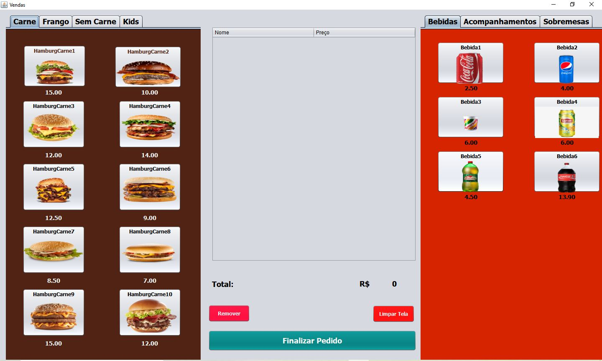
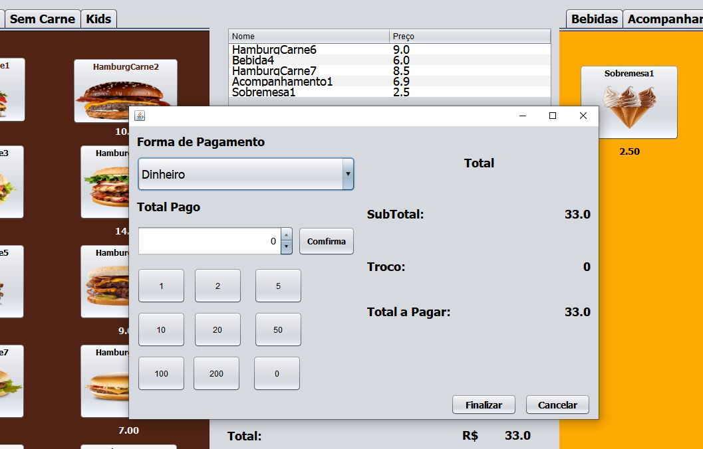

<h1 align="center">Sistema de Fastfood</h1> 

Sistema desenvolvido com Java

<h2 align="center">Tela de Principal</h2>

  
<h2 align="center">Tela Pagamento</h2>

 
<h2 align="center">Funcionamento</h2>

  <video width="320" height="240" controls>
  <source src="movie.mp4" type="video/mp4">
</video>

